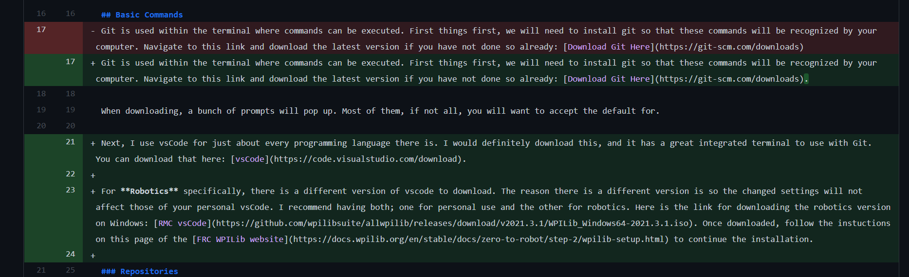
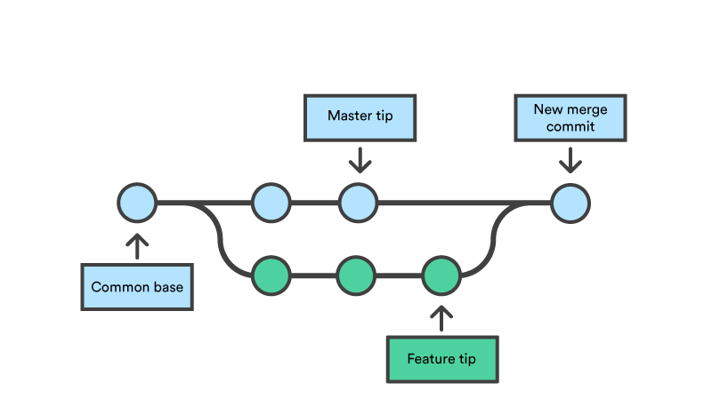

# Intro to Git
Git is used by just about every programmer in the workforce. It is mainly used as an easy way to colaborate. Why does using git make it so easy to colaborate? Here is an example.

Let's say that you have a working game. There are only a few different bugs and no big concerns. A programmer wants to work on fixing some of the bugs, but it wouldn't make sense for them to change the main program since it is currently functioning properly. This is where git comes in. 

Git will allow the programmer to take the existing code, and create a copy of it (or a "branch"). The programer can edit this copy until they believe they have the bug completely fixed. Then, when the programmer is satisfied, they can send a request to the owner to merge the fixed copy into the original code. This takes all the changes and copies them over into the main code. An example of a merge is shown below. 



Here, you can see what the owner would see when accepting this merge request. The programmer had changed a few things within the code as shown in green.

The path of this process is shown in the image below.



## Basic Commands
Git is used within the terminal where commands can be executed. First things first, we will need to install git so that these commands will be recognized by your computer. Navigate to this link and download the latest version if you have not done so already: [Download Git Here](https://git-scm.com/downloads).

When downloading, a bunch of prompts will pop up. Most of them, if not all, you will want to accept the default for.

Next, I use vsCode for just about every programming language there is. I would definitely download this, and it has a great integrated terminal to use with Git. You can download that here: [vsCode](https://code.visualstudio.com/download).

For **Robotics** specifically, there is a different version of vscode to download. The reason there is a different version is so the changed settings will not affect those of your personal vsCode. I recommend having both; one for personal use and the other for robotics. Here is the link for downloading the robotics version on Windows: [RMC vsCode](https://github.com/wpilibsuite/allwpilib/releases/download/v2021.3.1/WPILib_Windows64-2021.3.1.iso). Once downloaded, follow the instuctions on this page of the [FRC WPILib website](https://docs.wpilib.org/en/stable/docs/zero-to-robot/step-2/wpilib-setup.html) to continue the installation.

### Repositories
This is basically a folder with the code in it. This page that you are currently on is an example of one! It is holding all the code for this readme file. Once you create a repository with code in it, you will start committing changes to it as you work.

### Committing
Committing is basically like saving the code in the repository you are currently working in with a short description attached to it. We commit often so that it is easy to revert back to a previous commit if something in the code is no longer working. 

Examples:
```python
git commit -m "This is my commit message"
git commit --amend --no-edit #Ammends changes to the previous commit
git commit -h #Will show all the options
```

### Pushing
Although committing is like saving, it only saves the changes to your computer, or locally. In order to make changes in the cloud (where all the files are being stored for everyone else as well) you will have to push them. This will take all the commits since your last push, and send them to the cloud so everybody else can see the new commits you made. Commiting is not permanent, and neither is pushing, but pushing is much more confusing to revert than commits are.

Examples:
```python
git push
git push -f #A force push. Disregards warnings and pushes anyways. Can be dangerous.
git push -h #Shows the options
```

### Pulling
Pulling does exactly what it sounds like, it takes the most recent updated version of the repository and brings it onto your local computer. For example, if somebody else has pushed some commits to the cloud and you pull, you will see these changes on your own machine.

Examples:
```python
git pull
git fetch
```

### Branching
Creating a branch is useful for the example given in the intro. This is where a separate copy of the repository is created and then can be modified.

Examples:
```python
git branch testing #Creates a new branch named "testing"
git branch #Lists all the branches you have used locally
git checkout testing #Switches to the branch "testing"
git checkout -b new-branch #Creates a new branch and switches to it
git branch -h #Shows all the options
```

## Practice with Git
Here we will be editing this read me files and adding other files to practice with git.

### Create your own branch
Create a branch with your first and last name. For example, mine would be named `ryan-hodge`

### Changing the Code
Add a python if statement in this code block. Then commit and push to your branch!
```python
```

### Create Another Branch
Create a different branch named like `feature-<your_name>`. e.g. mine would be `feature-ryan-hodge`.

### Make Another Change
Change the for loop in this code block to print `Goodbye world` 100 times instead. Once finished, commit and push to the feature branch.
```python
for i in range(200):
    print('Hello world')
```

### Merge your 2 Branches Together
Use the following command to merge your two branches together. Take note of what happens.
```python
git checkout branch-name #Replace 'branch-name' with the branch you want to keep
git merge fix #Replace 'fix' with the branch you want to merge
```